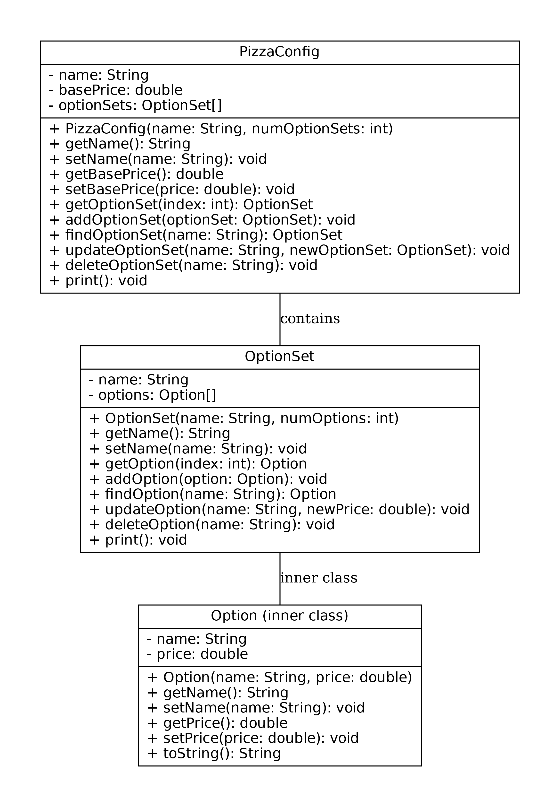

# Pizza Configuration Application - Project 1.0

## Table of Contents
- [Overview](#overview)
- [Features](#features)
- [Architecture & Design](#architecture--design)
- [Project Structure](#project-structure)
- [Installation & Setup](#installation--setup)
- [Usage](#usage)
- [Testing](#testing)
- [Documentation](#documentation)
- [Future Enhancements](#future-enhancements)
- [Credits](#credits)
- [License](#license)

## Overview
The **Pizza Configuration Application - Project 1.0** is a proof-of-concept application designed to simulate the configuration of pizza orders for a pizzeria. This initial version focuses on establishing a robust object model that adheres to industry best practices, SOLID principles, and object-oriented design (OOD).

The core components include:
- **PizzaConfig**: Represents a pizza configuration with a base price and a collection of option sets.
- **OptionSet**: Represents a group of options (such as size, toppings, etc.) for the pizza.
- **Option (Inner Class)**: Represents an individual option within an OptionSet, encapsulating details such as the option name and its additional price.

## Features
- **Object-Oriented Design:** Utilizes encapsulation, abstraction, and the use of inner classes.
- **CRUD Operations:** Provides Create, Read, Update, and Delete operations for managing pizza configurations and their options.
- **Serialization:** Implements Java serialization to archive and restore pizza configuration objects.
- **Comprehensive Testing:** Includes a robust JUnit test suite to ensure all functionalities are working as expected.
- **Clear Documentation:** The code is well-documented using Javadoc, and design artifacts such as UML diagrams are provided.

## Architecture & Design
The project follows a layered design:
- **Model Package (`model`)**: Contains the core data model classes.
  - **PizzaConfig.java**: Manages the overall pizza configuration, including the base price and an array of `OptionSet` objects.
  - **OptionSet.java**: Manages a set of options. Contains an inner class `Option` that defines an individual option.
- **Test Package (`test`)**: Contains JUnit tests to validate the behavior of the model classes.

### UML Diagram
Below is an illustrative UML diagram for the model:
  

  
*Note: Replace `uml_diagram.png` with your generated UML diagram image file.*

## Project Structure
```
PizzaConfigProject1.0/
├── src/
│   ├── model/
│   │   ├── PizzaConfig.java
│   │   └── OptionSet.java
│   └── test/
│       └── PizzaConfigTest.java
├── Graph1.0.pdf
├── Graph1.0.jpj
├── README.md
└── .gitignore
```

## Installation & Setup
### Prerequisites
- **Java Development Kit (JDK) 8** or higher
- **IntelliJ IDEA Ultimate**
- **Git** (for version control)

### Steps
1. **Clone the Repository:**
   ```bash
   git clone https://github.com/ahmdmshazly/PizzaConfigProject1.0.git
   cd PizzaConfigProject1.0
   ```

2. **Open in IntelliJ IDEA:**
    - Launch IntelliJ IDEA Ultimate.
    - Select **File > Open...** and navigate to the project directory.

3. **Build the Project:**
    - Use IntelliJ's **Build > Build Project** option to compile the project.

## Usage
### Running the Application
- **Demonstration via Test Driver:**
    - Currently, the main functionality is demonstrated via unit tests.
    - You can create a driver class (e.g., `TestDriver.java`) that instantiates a `PizzaConfig`, adds `OptionSet` objects (and inner `Option` objects), and prints the configuration to the console.

### Serialization
- The `PizzaConfig` class implements `Serializable`. This enables you to archive (serialize) and later restore (deserialize) the pizza configuration objects.
- Serialization functionality can be integrated into your driver program as needed.

## Testing
### Running Unit Tests
- **Using IntelliJ:**
    - Open the `PizzaConfigTest.java` file located in the `test` package.
    - Right-click inside the file and select **Run 'PizzaConfigTest'**.

- **Command Line (if using Maven/Gradle):**
    - **Maven:** `mvn test`
    - **Gradle:** `./gradlew test`

### Test Coverage
- **PizzaConfig CRUD Operations:** Adding, retrieving, updating, and deleting `OptionSet` objects.
- **OptionSet Operations:** Managing the inner `Option` objects (CRUD operations).
- **Print Method Validation:** Capturing and verifying console output.

## Documentation
- **Javadoc:**
    - The source code is fully documented using Javadoc.
    - You can generate the Javadoc via IntelliJ by navigating to **Tools > Generate JavaDoc**.
- **Design Documents:**
    - UML diagrams and design rationale are included in the repository.

## Future Enhancements
- **API Development (Project 1.1):**
    - Expand the application to include a robust API layer using interfaces and abstract classes.
- **File I/O and Multi-threading (Project 1.2):**
    - Integrate file input/output and multi-threading to support concurrent modifications.
- **Dynamic Collections:**
    - Refactor the model to use `ArrayList` and `LinkedHashMap` for improved data management.

## Credits
- **Developed by:** AHMED MOHAMED (amohame2), A GRADUATE STUDENT WHO IS TRYING TO SURVIVE BEFORE ANOTHER WORLD WAR HAPPENS.
- **Course:** DPSD (Design Patterns For Smartphones Development)
- **Institution:** CMU-Africa 

## License
This project is licensed under the [MIT License](LICENSE).

